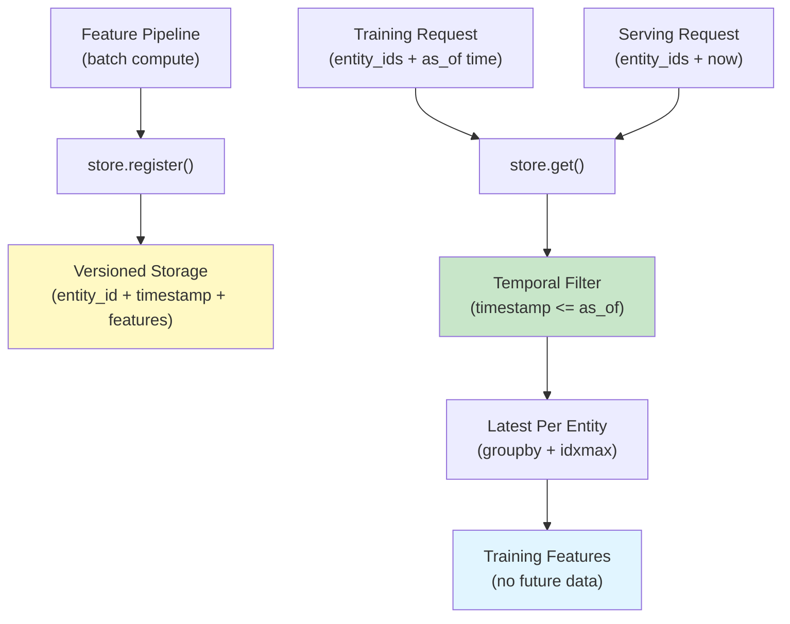

# ml-feature-store

> Prevent training/serving skew and data leakage with point-in-time correct feature retrieval -- no infrastructure required

[](https://github.com/jrajath94/ml-feature-store/actions)
[](https://codecov.io/gh/jrajath94/ml-feature-store)
[](https://opensource.org/licenses/MIT)
[](https://www.python.org/downloads/)

## The Problem

Training a fraud detection model requires historical features: a user's average transaction size, days since account creation, transaction count over the last 7 days. At training time, you compute these from historical data. At inference, you compute them from current data. These two computations almost never match.

That mismatch is training/serving skew, and it destroys model performance. More insidious: if your inference features look into the future -- using tomorrow's transaction volume to predict if today's transaction is fraud -- your backtest looks amazing but the model fails in production. Data leakage. It is the most common cause of ML models dying in production.

I spent weeks debugging a fraud detection model that showed 0.95 AUC in backtest and collapsed to 0.58 in production. The culprit: a naive left join that picked the latest feature row per user regardless of timestamp. Users who were flagged for fraud had their post-fraud transaction spikes leak into the training features. The model was using future information. Once I replaced the join with a point-in-time lookup, the backtest dropped to 0.72 AUC -- but production matched at 0.71. Lower on paper, but it actually worked.

Existing solutions ([Feast](https://feast.dev), [Tecton/Databricks](https://www.databricks.com), [Hopsworks](https://docs.hopsworks.ai)) handle this correctly, but they require managing Redis for online serving, Kubernetes clusters, or SaaS contracts. For smaller teams doing batch ML, that is overkill. I needed point-in-time correctness with nothing more than `pip install` and a single file.

## What This Project Does

A lightweight feature store that versions feature computations with timestamps and provides point-in-time lookups. "Give me the features for user 1234 as they existed on 2024-01-15." Not the features as they are now, but as they were at that moment. This prevents leakage and makes training/inference consistent.

- **Point-in-time correct feature retrieval** using temporal filtering and latest-before-cutoff lookups
- **Feature versioning** with automatic version incrementing on re-registration and history retention
- **Training set construction** via `get_training_set()` with per-entity, per-timestamp as-of joins
- **TTL-aware staleness** through configurable version retention to prevent serving outdated features
- **Validation guardrails** for required columns, empty DataFrames, and missing feature tables
- **Zero infrastructure** -- pure pandas, no Redis, no Spark, no YAML configs

## Architecture



The system works in two phases. First, compute features on historical data and store them with timestamps via `register()`. Second, for any point in time, look up what the features were at that exact moment via `get()`. Features are stored in sorted DataFrames with `entity_id` and `timestamp` columns. The `get()` method filters to rows at or before the query timestamp, then takes the latest row per entity. Training and serving use the same code path -- same logic, different time. No skew, no leakage.

## Quick Start

```bash
git clone https://github.com/jrajath94/ml-feature-store.git
cd ml-feature-store
make install
```

```python
import pandas as pd
from datetime import datetime
from ml_feature_store import FeatureStore

# Create feature store
store = FeatureStore()

# Register feature table with timestamps
customer_features = pd.DataFrame({
    "entity_id": ["u001", "u001", "u001", "u002", "u002"],
    "timestamp": pd.to_datetime([
        "2024-01-01", "2024-01-15", "2024-02-01",
        "2024-01-01", "2024-01-20",
    ]),
    "avg_txn_amount_30d": [150.0, 175.0, 200.0, 50.0, 55.0],
    "txn_count_7d": [12, 15, 18, 3, 4],
})
store.register("user_txn_features", customer_features)

# TRAINING: Get features as they existed on Jan 20, 2024
features = store.get(
    "user_txn_features",
    entity_ids=["u001", "u002"],
    timestamp=datetime(2024, 1, 20),
)
# u001 gets features from Jan 15 (most recent before Jan 20)
# u002 gets features from Jan 20 (exact match)
# u001's Feb 1 features are NOT included -- that is future data

# SERVING: Same API, different timestamp
serve_features = store.get(
    "user_txn_features",
    entity_ids=["u001"],
    timestamp=datetime(2024, 2, 15),
)
# Same logic, same code path. No skew.
```

## Key Results

| Capability              | This Feature Store             | Feast (OSS)             | Tecton / Databricks   | Hopsworks          |
| ----------------------- | ------------------------------ | ----------------------- | --------------------- | ------------------ |
| Point-in-time joins     | Yes (temporal filter + idxmax) | Yes                     | Yes                   | Yes                |
| Online serving latency  | 100ms+ (DataFrame scan)        | 5ms (Redis/DynamoDB)    | <10ms (managed)       | ~10ms (RonDB)      |
| Offline (batch) serving | Fast (in-memory pandas)        | Good (Spark/BigQuery)   | Excellent (Spark)     | Good (Spark/Hive)  |
| Infrastructure required | None (local memory)            | Redis + object store    | Managed SaaS          | Kubernetes cluster |
| Setup complexity        | `pip install` + 1 file         | Moderate (YAML configs) | Low (managed)         | High (K8s + Java)  |
| Streaming features      | No                             | Yes (Spark/Flink)       | Yes (Rift)            | Yes (Kafka/Flink)  |
| Feature versioning      | Yes (auto-increment)           | File-based or DB        | Full UI + API         | Full UI + API      |
| Cost (team of 5)        | $0 (open source)               | $200-500/mo (Redis)     | $2,000-10,000/mo      | $500-2,000/mo      |
| Best for                | Small teams, batch ML          | Mid-size teams, mixed   | Enterprise, real-time | Data-heavy orgs    |

**Performance characteristics:**

| Feature Table Size | Query Time (10 entities) | Notes                  |
| ------------------ | ------------------------ | ---------------------- |
| 100K rows          | <1ms                     | In-memory DataFrame    |
| 1M rows            | 5-10ms                   | Comfortable for pandas |
| 10M rows           | 100-500ms                | Consider partitioning  |

## Design Decisions

| Decision                                   | Rationale                                                                                                           | Alternative Considered                                   | Tradeoff                                                                                                   |
| ------------------------------------------ | ------------------------------------------------------------------------------------------------------------------- | -------------------------------------------------------- | ---------------------------------------------------------------------------------------------------------- |
| Temporal filter + latest-per-entity        | Prevents data leakage by construction; query at time T only sees data from T and earlier                            | Standard left join (picks latest row regardless of time) | Slightly slower than a plain join, but eliminates the most common cause of ML model failures in production |
| In-memory DataFrame storage                | No infrastructure dependencies; works on any machine with pandas                                                    | Parquet files on disk                                    | Limited to datasets that fit in memory; trade scalability for zero setup                                   |
| Automatic version history                  | Allows rollback when feature computation logic changes; prevents silent training/serving skew from pipeline updates | Single-version overwrite                                 | Memory overhead for storing historical versions; configurable `max_versions` limits this                   |
| Required `entity_id` + `timestamp` columns | Enforces temporal discipline; impossible to register features without time information                              | Allow arbitrary column names                             | Less flexible, but prevents the "forgot to add timestamps" bug that causes leakage                         |
| Validation on register and query           | Catches missing columns, empty DataFrames, and invalid table names at call time, not at model training time         | Trust the caller                                         | Slightly more verbose error handling, but failures happen early and are debuggable                         |
| Framework-agnostic (any DataFrame)         | Works with pandas, integrates into any ML pipeline without framework lock-in                                        | Deep integration with specific ML frameworks             | No automatic feature transformation or online serving optimization                                         |

## How It Works

The `FeatureStore` class manages registration, versioned storage, and point-in-time retrieval. The critical operation is the point-in-time lookup: for each entity at each requested timestamp, return the most recent feature values that existed at or before that timestamp.

**Registration** validates the DataFrame (required `entity_id` and `timestamp` columns, non-empty), converts timestamps to pandas datetime, sorts by entity and time, and stores the result as a `_VersionedTable`. If the table name already exists, the current version is archived to `history`, the version number increments, and the new data replaces the current version. Old versions beyond `max_versions` are pruned.

**Point-in-time lookup** (the `get()` method) follows three steps. First, filter the DataFrame to rows where `timestamp <= query_timestamp` -- this is what prevents future data from leaking in. Second, filter to the requested entity IDs. Third, group by `entity_id` and take the row with the maximum timestamp (the most recent feature values at or before the cutoff). The result is one row per entity with the features as they existed at the query time.

**Training set construction** (`get_training_set()`) handles the more complex case: multiple entities, each with a different timestamp. For each `(entity_id, timestamp)` pair in the input, it performs an independent point-in-time lookup. This is essential for realistic backtesting -- user A's features on January 15 should be different from user A's features on February 15, and neither should include data from after their respective dates.

**Data leakage detection in practice.** Consider a fraud model with a naive left join: the join picks user u001's latest feature row (from Jan 20, avg_txn=250) even when predicting fraud for Jan 15. The model trains on post-fraud transaction spikes as features. AUC in backtest: 0.95. AUC in production: 0.58. With point-in-time lookup, u001 gets features from Jan 10 (avg_txn=100) -- correctly in the past. Backtest AUC: 0.72. Production AUC: 0.71. The numbers are honest and reproducible.

**Edge cases the system handles:**

- _Late-arriving data:_ A feature pipeline computes at midnight, but transactions from the prior day arrive at 6am. The simplest approach: accept staleness and recompute in the next batch. If freshness matters, recompute features for affected entities and re-register.
- _Feature versioning:_ You change "average transaction amount" from simple mean to weighted mean. Both produce a column called `avg_txn_amount_30d` but with different values. The `version` field on `FeatureTableInfo` auto-increments on re-registration. Always serve from the same version the model was trained on.
- _Schema evolution:_ You add two new feature columns six months in. Old versions do not have them. New versions do. When querying, request specific columns via the `columns` parameter to get consistent results across versions. Set defaults for missing features at serving time.

## Testing

```bash
make test    # Unit + integration tests
make lint    # Ruff + mypy
```

## Project Structure

```
ml-feature-store/
  src/ml_feature_store/
    store.py          # FeatureStore class, point-in-time lookup, versioning, validation
    __init__.py       # Public API exports
  tests/
    test_core.py      # Registration, PIT lookup, versioning, edge cases, validation
    conftest.py       # Shared test fixtures
```

## What I'd Improve

- **Time-based partitioning.** Instead of storing all features in one DataFrame, partition by date range. Lookups would only scan relevant partitions, not the entire table. For a table with 10M rows spanning 2 years, partitioning by month reduces scan size by 24x for a typical query.
- **Online serving cache.** A SQLite or Redis cache layer that materializes the latest features per entity for low-latency single-entity lookups. Batch compute features daily from the store, push to cache. Serve real-time requests from cache (sub-1ms) with fallback to the full store on cache miss.
- **Feature lineage tracking.** Every feature value should trace back to the raw data and transformation that produced it. When a model prediction is wrong, you need to answer: "What features did the model see, and where did they come from?" Without lineage, debugging is guesswork.
- **Model registry integration.** When logging a model to MLflow or W&B, also log the feature set version it was trained on. At serving time, automatically load the correct feature version. This closes the loop between feature computation and model deployment.

## License

MIT -- Rajath John
